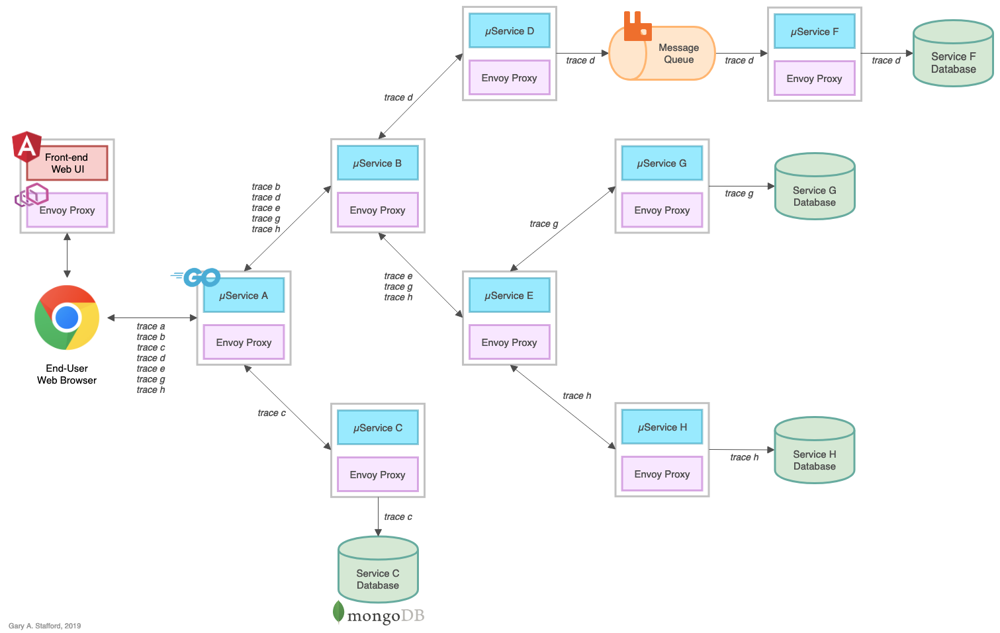

# Go-based Microservices Observability Demo with Istio 1.0.x

The (8) Go-based, RESTful microservices, which make up this reference distributed system platform, are designed to generate service-to-service, service-to-database (MongoDB), and service-to-queue-to-service (RabbitMQ) IPC (inter-process communication). These distributed communications can be observed using Istio's observability tools, Zipkin, Jaeger, Kiali, Service Graph, Prometheus, and Grafana, when the system is deployed to Kubernetes.


## Optional Front-end UI

An Angular 7 front-end UI to the API is located on Github: [k8s-istio-observe-frontend](https://github.com/garystafford/k8s-istio-observe-frontend).

## Architecture



## Traces

A 'trace' JSON object is returned by each service to the up-stream calling service (show below). The traces have no real function other than to confirm the service-to-service calls succeeded. They do not support or enhance Istio's observability capabilities.

```json
{
  "id": "aaa0c36b-ac16-4e29-801b-84a7e4fe99a4",
  "service": "Service-A",
  "greeting": "Hello, from Service-A!",
  "created": "2019-03-04T01:29:44.3329817Z"
}
```

## Docker Swarm Deployment

This README outlines deploying the Microservices/RabbitMQ/MongDB stack locally to Docker Swarm. Then, deploying the same stack to Google Kubernetes Engine (GKE) on the Google Cloud Platform (GCP), with Istio 1.0.6 and all associated telemetry components: Prometheus, Grafana, Zipkin, Jaeger, Service Graph, and Kiali.

### Requirements

-   Docker
-   Helm
-   `gcloud` CLI
-   Istio 1.0.6
-   Jinja2 (pip install) - _optional_

### Optional: Build and Push Docker Images

All Docker images, references in the Docker Swarm and Kubernetes resource files, for the microservices and UI, are available on [Docker Hub](https://hub.docker.com/u/garystafford/). To build all images yourself, modify and use these two scripts.

```bash
time sh ./part1_build_srv_images.sh
time sh ./part2_push_images.sh
```

### Deployed Stack Services

Create Docker overlay network, and deploy Docker Swarm, locally, consisting of (11) containers: (1) Angular 7 Front-end UI, (8) Go-based microservices, (1) RabbitMQ server with (1) queue, and (1) MongoDB server with (4) databases.

```bash
docker stack rm golang-demo
sleep 5
docker network create -d overlay --attachable golang-demo
docker stack deploy -c stack.yml golang-demo

docker stack services golang-demo --format "table {{.Name}}\t{{.Image}}\t{{.Ports}}" | sort
```

```text
> docker stack services golang-demo --format "table {{.Name}}\t{{.Image}}\t{{.Ports}}" | sort

NAME                     IMAGE                                PORTS
golang-demo_angular-ui   garystafford/angular-observe:1.1.0   *:80->80/tcp
golang-demo_mongodb      mongo:latest                         *:27017->27017/tcp
golang-demo_rabbitmq     rabbitmq:management                  *:5672->5672/tcp, *:15672->15672/tcp
golang-demo_service-a    garystafford/go-srv-a:1.1.0          *:8000->80/tcp
golang-demo_service-b    garystafford/go-srv-b:1.1.0
golang-demo_service-c    garystafford/go-srv-c:1.1.0
golang-demo_service-d    garystafford/go-srv-d:1.1.0
golang-demo_service-e    garystafford/go-srv-e:1.1.0
golang-demo_service-f    garystafford/go-srv-f:1.1.0
golang-demo_service-g    garystafford/go-srv-g:1.1.0
golang-demo_service-h    garystafford/go-srv-h:1.1.0
```

## Accessing the Docker Swarm-based Stack

To start, call the Angular 7 Front-end UI: <http://localhost:80/>

Alternately, call Service A, the system's edge service: <http://localhost:8000/api/ping>

To observe the queue traffic, use the RabbitMQ Management Console: <http://localhost:15672/>

To observe the databases, use MongoDB Compass: localhost:27017

## Output from Service A

```json
[
    {
        "id": "e9e11d0e-0701-4d78-81f9-42b734cb52ee",
        "service": "Service-D",
        "greeting": "Shalom, from Service-D!",
        "created": "2019-03-04T01:29:44.2013268Z"
    },
    {
        "id": "7dfcfa4e-4218-4830-abb4-00caa54881ec",
        "service": "Service-G",
        "greeting": "Ahlan, from Service-G!",
        "created": "2019-03-04T01:29:44.2437703Z"
    },
    {
        "id": "825947a1-4dc3-410b-b484-61aeb4fc1b0f",
        "service": "Service-H",
        "greeting": "Ciao, from Service-H!",
        "created": "2019-03-04T01:29:44.2751858Z"
    },
    {
        "id": "b8ac5f8b-06f6-4d2c-9289-d351bd114240",
        "service": "Service-E",
        "greeting": "Bonjour, de Service-E!",
        "created": "2019-03-04T01:29:44.2975462Z"
    },
    {
        "id": "4daea39f-76f3-4195-9e41-0089b3ba83f6",
        "service": "Service-B",
        "greeting": "Namaste, from Service-B!",
        "created": "2019-03-04T01:29:44.2989455Z"
    },
    {
        "id": "aacf3c1c-20a5-4b45-83fc-99a0e4e900c8",
        "service": "Service-C",
        "greeting": "Konnichiwa, from Service-C!",
        "created": "2019-03-04T01:29:44.3004077Z"
    },
    {
        "id": "aaa0c36b-ac16-4e29-801b-84a7e4fe99a4",
        "service": "Service-A",
        "greeting": "Hello, from Service-A!",
        "created": "2019-03-04T01:29:44.3329817Z"
    }
]
```

## Docker Stats

A quick look at the services and their typical loads, using Apache Bench (ab).

```bash
ab -kc 100 -n 10000 http://localhost:8000/api/ping
```

```bash
docker stats --all --format "table {{.Name}}\t{{.CPUPerc}}\t{{.MemUsage}}"
```

```text
NAME                                                CPU %               MEM USAGE / LIMIT
golang-demo_mongodb.1.k3kten2dg4sjba0s5l4o79w5b     47.05%              697.3MiB / 1.952GiB
golang-demo_rabbitmq.1.jittnz3ezzbh4cqnzqgcchlgd    5.08%               84.46MiB / 1.952GiB

golang-demo_service-a.1.lgtj4mj29ra4ify59v84nefqm   0.22%               6.859MiB / 1.952GiB
golang-demo_service-b.1.rux5d1je9s90aw28jf7x2ws6a   0.15%               6.969MiB / 1.952GiB
golang-demo_service-c.1.5olitvlahtnbz8daxx0cup4ty   30.27%              126.1MiB / 1.952GiB
golang-demo_service-d.1.vyge7w7q8213oyipeyu092zww   0.62%               5.855MiB / 1.952GiB
golang-demo_service-e.1.km2y4zfpelzq166os1hy3si0h   0.59%               7.117MiB / 1.952GiB
golang-demo_service-f.1.flhgix40ctk3j160v5sz82q1v   1.32%               1.695MiB / 1.952GiB
golang-demo_service-g.1.ii62ga8kqa3p44x94z97xknts   32.54%              122.7MiB / 1.952GiB
golang-demo_service-h.1.r75tk7cz4szwbluagrpaz04v6   29.78%              123.2MiB / 1.952GiB
```

## Other Useful Docker Commands

```bash
docker stack ps golang-demo --no-trunc
docker stack services golang-demo
docker stack rm golang-demo

docker exec -it \
  $(docker ps | grep golang-demo_mongodb.1 | awk '{print $NF}') sh
mongo
show dbs
use service-c
db.traces.find().pretty()

docker logs \
  $(docker ps | grep golang-demo_service-f.1 | awk '{print $NF}')

docker logs \
  $(docker ps | grep golang-demo_rabbitmq.1 | awk '{print $NF}')
```

## GKE Deployment

### Optional: Build Kubernetes Deployment and Service Resources

The Kubernetes Deployment and Service resources for (8) Go-based microservices were built using a common Jinja2 template (resources/services/templates/service.j2). To re-build the YAML files, run the following script.

```bash
cd golang-srv-demo/resources/services/templates
python3 ./service-builder.py
```

### Build and Deploy GKE Cluster

Build and deploy to a 3-node GKE Cluster, with Istio 1.0.6 and all Istio telemetry components.
Requires Istio 1.0.6 is downloaded and available. Requires Helm to be available from the command-line, locally. Update constants in all scripts before running.

```bash
time sh ./part3_create_gke_cluster.sh
time sh ./part4_install_istio.sh
time sh ./part5a_deploy_resources.sh

istioctl get all

# https://github.com/rakyll/hey
hey -n 500 -c 10 -h2 http://api.dev.example-api.com
```

## Tear Down GKE Cluster

```bash
time sh ./part6_tear_down.sh
```

## References

-   <https://istio.io/docs/reference/config/installation-options/>
-   <https://github.com/istio/istio/tree/master/install/kubernetes/helm/istio>
-   <https://kubernetes.io/docs/concepts/overview/working-with-objects/common-labels/>
-   <https://thenewstack.io/make-a-restful-json-api-go/>
-   <https://github.com/istio/istio/blob/aa034934c7f2a2a265224061c066eae88a652703/install/kubernetes/helm/istio/README.md>
