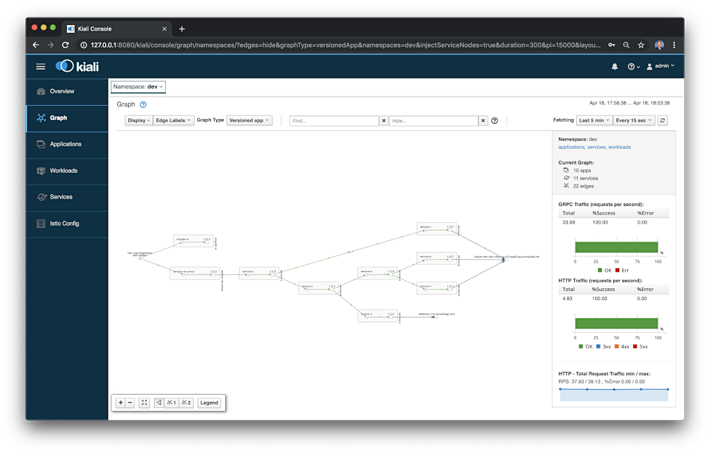
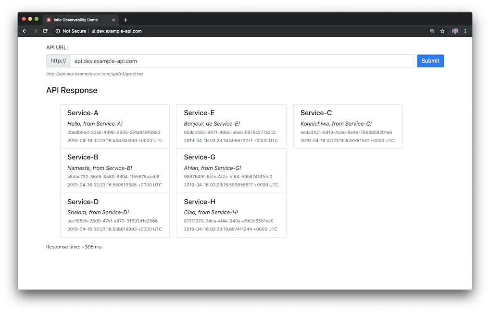

# Go-based Microservices Observability Demo with Istio

**Successfully tested with Istio 1.1.3, released 4/15/2019**

The (8) Go-based RESTful microservices and (1) gRPC Gateway Reverse Proxy, which make up this reference distributed system platform, are designed to generate HTTP/JSON and gRPC/protobuf-based service-to-service, TCP-based service-to-database (MongoDB), and TCP-based service-to-queue-to-service (RabbitMQ) IPC (inter-process communication). Service A calls Service B and Service C, Service B calls Service D and Service E, Service D produces a message on a RabbitMQ queue that Service F consumes and writes to MongoDB, and so on. These distributed communications can be observed using Istio's observability tools, Jaeger, Kiali, Prometheus, and Grafana, when the system is deployed to Kubernetes with Istio.



## Optional Front-end UI

An Angular 7 front-end UI to the API is located on Github: [k8s-istio-observe-frontend](https://github.com/garystafford/k8s-istio-observe-frontend).



## Architecture


## Service Responses

On the reference platform, each upstream service responds to requests from downstream services by returning a small informational JSON payload (termed a greeting in the source code).

```json
{
  "id": "844ea9c7-b340-4956-9c8b-f28ae42d0f4a",
  "service": "Service-A",
  "message": "Hello, from Service-A!",
  "created": "2019-03-17T16:10:16.4982543Z"
}
```

## Deployment

The post, [Kubernetes-based Microservice Observability with Istio Service Mesh: Part 1](https://wp.me/p1RD28-6fL), outlines deploying the stack to Google Kubernetes Engine (GKE) on the Google Cloud Platform (GCP), with Istio 1.1.x and all associated telemetry components: Prometheus, Grafana, Zipkin, Jaeger, Service Graph, and Kiali.

### Requirements

-   Docker
-   Helm
-   `gcloud` CLI
-   Istio 1.1.x
-   Jinja2 (pip install) - _optional_

### Optional: Build and Push Docker Images

All Docker images, references in the Docker Swarm and Kubernetes resource files, for the microservices and UI, are available on [Docker Hub](https://hub.docker.com/u/garystafford/). To build all images yourself, modify and use these two scripts.

```bash
time bash part1_build_srv_images.sh
time bash part2_push_images.sh
```

## Output from Service A via gRPC Gateway Reverse Proxy

```json
{
  "greeting": [
    {
        "id": "9f12e095-989f-49aa-80f7-05f27a1ae2ef",
        "service": "Service-D",
        "message": "Shalom, from Service-D!",
        "created": "2019-03-17T16:10:16.197706983Z"
    },
    {
        "id": "a2ed6cac-88bc-42b5-9d94-7b64a655ead9",
        "service": "Service-G",
        "message": "Ahlan, from Service-G!",
        "created": "2019-03-17T16:10:16.229348021Z"
    },
    {
        "id": "d5384ee3-1d43-460a-abc8-142e5d5f5b8e",
        "service": "Service-H",
        "message": "Ciao, from Service-H!",
        "created": "2019-03-17T16:10:16.293059651Z"
    },
    {
        "id": "953d654d-5c32-4d5d-9ce1-e158dee3701b",
        "service": "Service-E",
        "message": "Bonjour, de Service-E!",
        "created": "2019-03-17T16:10:16.414109276Z"
    },
    {
        "id": "98a73e02-9c4a-443a-a4c9-1f0216d5c099",
        "service": "Service-B",
        "message": "Namaste, from Service-B!",
        "created": "2019-03-17T16:10:16.415805403Z"
    },
    {
        "id": "d5cd62d4-fe79-4b6b-81a9-80d59f3d42c3",
        "service": "Service-C",
        "message": "Konnichiwa, from Service-C!",
        "created": "2019-03-17T16:10:16.420415356Z"
    },
    {
        "id": "844ea9c7-b340-4956-9c8b-f28ae42d0f4a",
        "service": "Service-A",
        "message": "Hello, from Service-A!",
        "created": "2019-03-17T16:10:16.4982543Z"
    }
  ]
}
```

## GKE Deployment

### Optional: Build Kubernetes Deployment and Service Resources

The Kubernetes Deployment and Service resources for (8) Go-based microservices were built using a common Jinja2 template (resources/services/templates/service.j2). To re-build the YAML files, run the following script.

```bash
cd golang-srv-demo/resources/services/templates
python3 ./service-builder.py
```

### Build and Deploy GKE Cluster

Build and deploy to a 3-node GKE Cluster, with Istio 1.1.x and all Istio telemetry components.
Requires Istio 1.1.x is downloaded and available. Requires Helm to be available from the command-line, locally. Update constants in all scripts before running.

```bash
time bash part3_create_gke_cluster.sh
export ISTIO_HOME && time bash part4_install_istio.sh
time bash part5_deploy_resources.sh

istioctl get all
```

## Install `hey`

<https://github.com/rakyll/hey>

```bash
go get -u github.com/rakyll/hey
cd go/src/github.com/rakyll/hey/
go build
./hey -n 500 -c 10 -h2 http://api.dev.example-api.com
./hey -n 1000 -c 10 -h2 http://api.dev.example-api.com/api/greeting
./hey -n 1000 -c 25 -h2 http://api.dev.example-api.com/api/greeting
./hey -n 2000 -c 50 -h2 http://api.dev.example-api.com/api/greeting
```

## Port Forward to Tools

```bash
# Jaeger
kubectl port-forward -n istio-system $(kubectl get pod -n istio-system -l app=jaeger -o jsonpath='{.items[0].metadata.name}') 16686:16686 &

# Grafana
kubectl port-forward -n istio-system $(kubectl get pod -n istio-system -l app=grafana -o jsonpath='{.items[0].metadata.name}') 3000:3000 &

# Prometheus
kubectl -n istio-system port-forward $(kubectl -n istio-system get pod -l app=prometheus -o jsonpath='{.items[0].metadata.name}') 9090:9090 &

# Kiali
kubectl -n istio-system port-forward $(kubectl -n istio-system get pod -l app=kiali -o jsonpath='{.items[0].metadata.name}') 20001:20001 &
```

## Prometheus Query Examples

```text
up{namespace="dev",pod_name=~"service-.*"}

container_memory_max_usage_bytes{namespace="dev",container_name="service-f"}
container_memory_max_usage_bytes{namespace="dev",container_name=~"service-.*"}

container_network_transmit_packets_total{namespace="dev",pod_name=~"service-e-.*"}

istio_requests_total{destination_service_namespace="dev",connection_security_policy="mutual_tls",destination_app="service-a"}

istio_response_bytes_count{destination_service_namespace="dev",connection_security_policy="mutual_tls",source_app="service-a"}
```

## Tear Down GKE Cluster

```bash
time bash ./part6_tear_down.sh
```

## References

-   <https://istio.io/docs/reference/config/installation-options/>
-   <https://github.com/istio/istio/tree/master/install/kubernetes/helm/istio>
-   <https://kubernetes.io/docs/concepts/overview/working-with-objects/common-labels/>
-   <https://thenewstack.io/make-a-restful-json-api-go/>
-   <https://github.com/istio/istio/blob/aa034934c7f2a2a265224061c066eae88a652703/install/kubernetes/helm/istio/README.md>
