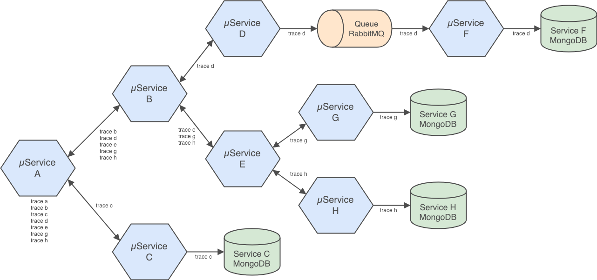

# Go-based Microservices Observability Demo with Kubernetes and Istio 1.0

__Work In Progress__

The (7) Go-based microservices are designed to generate service-to-service, service-to-db, and service-to-queue-to-service IPC. These communications can be observed using Istio's observability tools.

A 'trace' object is returned by each service to the up-stream calling service. The traces have no real function other than to confirm the service calls succeeded. They do not support or enhance Istio's observability capabilities.



## Build and Deploy

Build all images, create Docker overlay network, and deploy Swarm of (10) contains: (7) Go microservices, (1) RabbitMQ server with (1) queue, and (1) MongoDB server with (4) databases.

```bash
sh ./build_go_srv_images.sh
```

## URLs for Docker Swarm

To start, call Service A, the system
's edge service: <http://localhost:8100/ping>

To observe the queue traffic, use the RabbitMQ Management Console: <http://localhost:15672/>

To observe the databases, use MongoDB Compass: localhost:27017

## Output from Service A

```json
[{
    "id": "1575c539-7871-4b91-8788-a29fccc51dfd",
    "serviceName": "Service-D",
    "createdAt": "2019-02-04T01:01:14.2423788Z"
  },
  {
    "id": "00b8c6d9-ce6f-4570-b101-5a9b49c43d90",
    "serviceName": "Service-G",
    "createdAt": "2019-02-04T01:01:14.2807012Z"
  },
  {
    "id": "4c473aee-f2fe-4317-a283-f64e2e7c0db7",
    "serviceName": "Service-H",
    "createdAt": "2019-02-04T01:01:14.3016563Z"
  },
  {
    "id": "c59bbed1-2350-45ef-9588-361d97c1fa3b",
    "serviceName": "Service-E",
    "createdAt": "2019-02-04T01:01:14.3150472Z"
  },
  {
    "id": "92b6c13e-c43d-4488-8613-937baad90b74",
    "serviceName": "Service-B",
    "createdAt": "2019-02-04T01:01:14.3161737Z"
  },
  {
    "id": "29494eb4-baf9-4333-abc4-a4990b8d0f2b",
    "serviceName": "Service-C",
    "createdAt": "2019-02-04T01:01:14.3173983Z"
  },
  {
    "id": "7ca10884-6d4f-4cdd-adf9-9cc34d883d40",
    "serviceName": "Service-A",
    "createdAt": "2019-02-04T01:01:14.3287177Z"
  }
]
```

## Other Useful Commands

```bash
docker exec -it \
  $(docker ps | grep golang-demo_mongodb.1 | awk '{print $NF}') sh
mongo
show dbs
use service-c
db.traces.find().pretty()

docker logs \
  $(docker ps | grep golang-demo_service-f.1 | awk '{print $NF}')

docker logs \
  $(docker ps | grep golang-demo_rabbitmq.1 | awk '{print $NF}')
```
