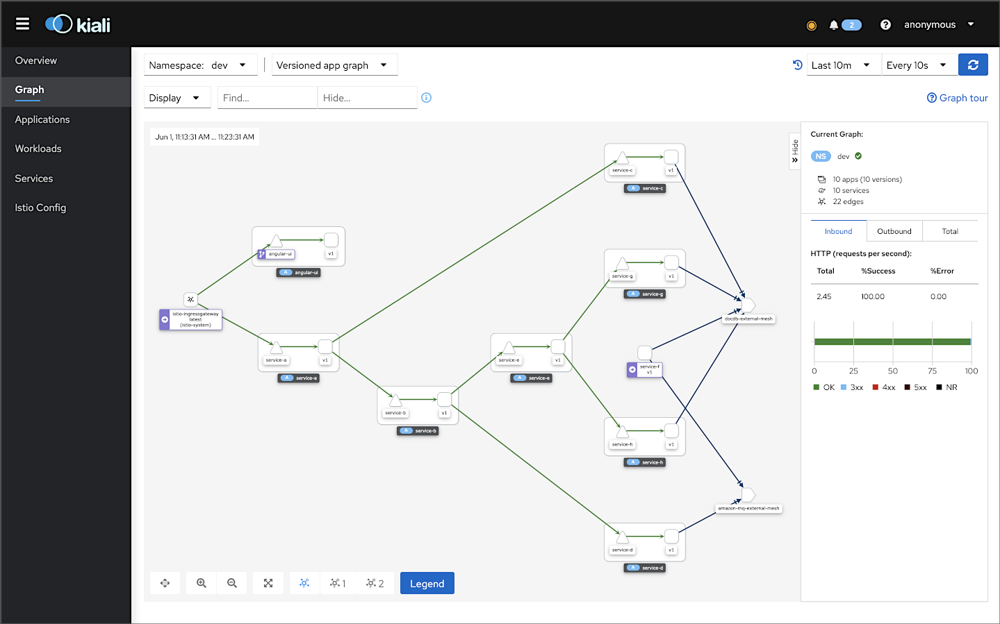
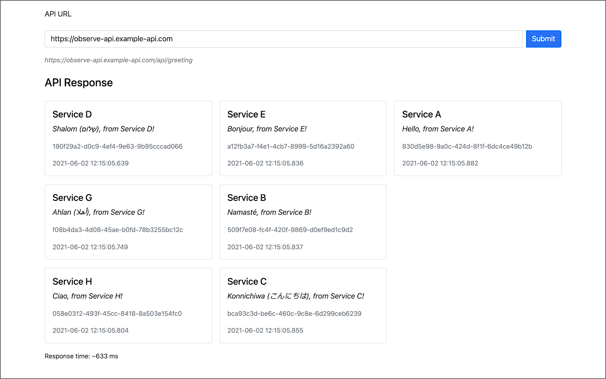
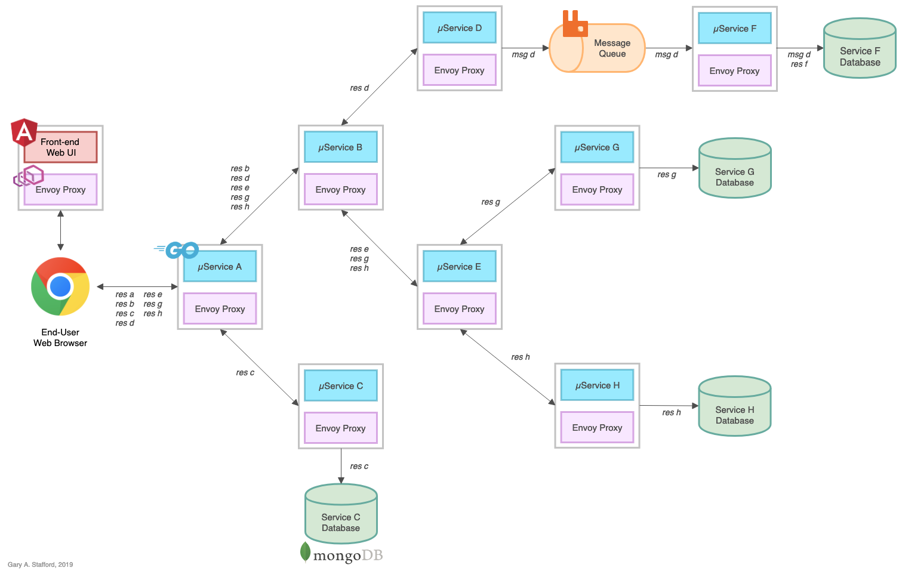
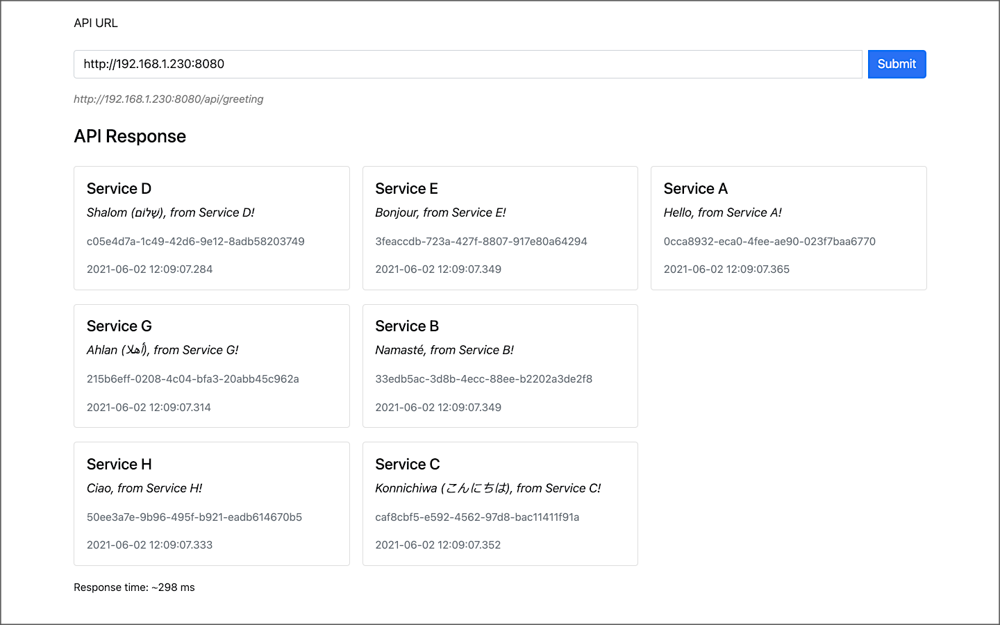

# Kubernetes-based Microservice Observability with Istio Service Mesh

Source code for the two-part blog
post, [Kubernetes-based Microservice Observability with Istio Service Mesh](https://garystafford.medium.com/kubernetes-based-microservice-observability-with-istio-service-mesh-part-1-of-2-19084d13a866). See the post for detailed instructions.



## Frontend UI

An Angular 12 front-end UI to the API is located on
Github: [k8s-istio-observe-frontend](https://github.com/garystafford/k8s-istio-observe-frontend/tree/2021-istio).



## Reference Platform Architecture



## Service Responses

On the reference platform, each upstream service responds to requests from downstream services by returning a small
informational JSON payload (termed a greeting in the source code).

```json
{
  "id": "fc65e292-eb40-43ee-810f-f819764cae61",
  "service": "Service-A",
  "message": "Hello, from Service-A!",
  "created": "2021-05-22T23:31:10.489864529Z"
}
```

### Complete response from Service A

```json
[
  {
    "id": "c90f542d-22e6-401c-8361-422fea719f15",
    "service": "Service-D",
    "message": "Shalom (שָׁלוֹם), from Service-D!",
    "created": "2021-05-22T23:31:10.402441212Z"
  },
  {
    "id": "713156eb-f91c-4591-ab51-07d107185d61",
    "service": "Service-G",
    "message": "Ahlan (أهلا), from Service-G!",
    "created": "2021-05-22T23:31:10.4324182Z"
  },
  {
    "id": "22bdf2c8-1262-441e-b799-b3c4d68392df",
    "service": "Service-H",
    "message": "Ciao, from Service-H!",
    "created": "2021-05-22T23:31:10.454751483Z"
  },
  {
    "id": "f292a648-0f35-4248-8852-fde4035052dc",
    "service": "Service-E",
    "message": "Bonjour, from Service-E!",
    "created": "2021-05-22T23:31:10.468721423Z"
  },
  {
    "id": "523ddd56-5068-4d32-83dc-511545fc5fbb",
    "service": "Service-B",
    "message": "Namasté, from Service-B!",
    "created": "2021-05-22T23:31:10.469495924Z"
  },
  {
    "id": "d6cca80b-f238-428d-9db9-3658ba072e1e",
    "service": "Service-C",
    "message": "Konnichiwa (こんにちは), from Service-C!",
    "created": "2021-05-22T23:31:10.471593632Z"
  },
  {
    "id": "fc65e292-eb40-43ee-810f-f819764cae61",
    "service": "Service-A",
    "message": "Hello, from Service-A!",
    "created": "2021-05-22T23:31:10.489864529Z"
  }
]
```

## Optional Docker Swarm Deployment

In addition to Kubernetes, you can deploy the reference platform to Docker Swarm. Create Docker overlay network, and deploy Docker Swarm, locally, consisting of (12) containers:

- (1) Angular 12 frontend UI
- (8) backend Go-based microservices
- (1) RabbitMQ server with (1) queue
- (1) MongoDB server with (4) databases
- (1) Mongo Express

```bash
docker network create -d overlay --attachable golang-demo

docker stack deploy -c docker_swarm/stack.yml golang-demo
```

### View the Running Stack

```text
> docker stack services golang-demo --format "table {{.Name}}\t{{.Image}}\t{{.Ports}}" | sort

NAME                        IMAGE                                PORTS
golang-demo_angular-ui      garystafford/angular-observe:1.6.5   *:80->80/tcp
golang-demo_mongodb         mongo:4.4.6                          *:27017->27017/tcp
golang-demo_mongo_express   mongo-express:0.54.0                 *:8081->8081/tcp
golang-demo_rabbitmq        rabbitmq:3.8.16-management-alpine    *:5672->5672/tcp, *:15672->15672/tcp
golang-demo_service-a       garystafford/go-srv-a:1.6.5          *:8080->8080/tcp
golang-demo_service-b       garystafford/go-srv-b:1.6.5
golang-demo_service-c       garystafford/go-srv-c:1.6.5
golang-demo_service-d       garystafford/go-srv-d:1.6.5
golang-demo_service-e       garystafford/go-srv-e:1.6.5
golang-demo_service-f       garystafford/go-srv-f:1.6.5
golang-demo_service-g       garystafford/go-srv-g:1.6.5
golang-demo_service-h       garystafford/go-srv-h:1.6.5
```

### Accessing the Docker Swarm-based Stack

To start, call the Angular 12 Frontend UI: <http://localhost>

The backend API's URL will be: <http://localhost:8080>

Alternately, call Service A, the system's edge service, directly: <http://localhost:8080/api/greeting>

To observe the queue traffic, use the RabbitMQ Management Console: <http://localhost:15672>

To observe the databases, use Mongo Express: <http://localhost:8081>

### View of UI running on Docker

