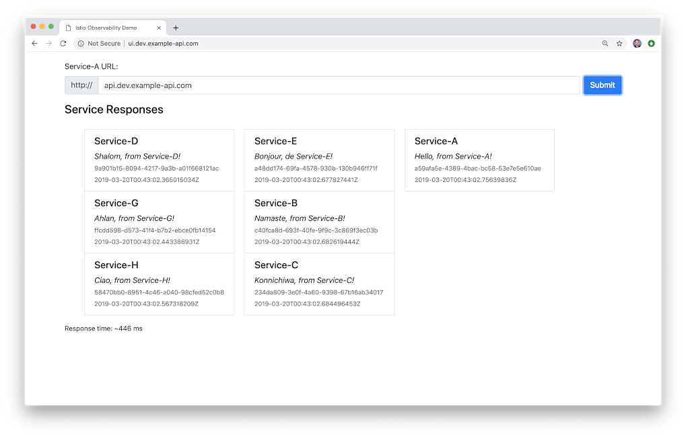

# Go-based Microservices Observability Demo with Istio

**Successfully tested with Istio 1.1.3, released 4/15/2019**

The (8) Go-based, RESTful microservices, which make up this reference distributed system platform, are designed to
generate HTTP-based service-to-service, TCP-based service-to-database (MongoDB), and TCP-based
service-to-queue-to-service (RabbitMQ) IPC (inter-process communication). Service A calls Service B and Service C,
Service B calls Service D and Service E, Service D produces a message on a RabbitMQ queue that Service F consumes and
writes to MongoDB, and so on. These distributed communications can be observed using Istio's observability tools,
Jaeger, Kiali, Prometheus, and Grafana, when the system is deployed to Kubernetes with Istio.


## Optional Front-end UI

An Angular 7 front-end UI to the API is located on
Github: [k8s-istio-observe-frontend](https://github.com/garystafford/k8s-istio-observe-frontend).



## Architecture


## Service Responses

On the reference platform, each upstream service responds to requests from downstream services by returning a small
informational JSON payload (termed a greeting in the source code).

```json
{
  "id": "844ea9c7-b340-4956-9c8b-f28ae42d0f4a",
  "service": "Service-A",
  "message": "Hello, from Service-A!",
  "created": "2019-03-17T16:10:16.4982543Z"
}
```

## Docker Swarm Deployment

The post, [Kubernetes-based Microservice Observability with Istio Service Mesh: Part 1](https://wp.me/p1RD28-6fL),
outlines deploying the stack to Google Kubernetes Engine (GKE) on the Google Cloud Platform (GCP), with Istio 1.1.x and
all associated telemetry components: Prometheus, Grafana, Zipkin, Jaeger, Service Graph, and Kiali. This README outlines
deploying the Microservices/RabbitMQ/MongoDB stack locally to Docker Swarm

### Requirements

- Docker
- Helm
- `gcloud` CLI
- Istio 1.1.x
- Jinja2 (pip install) - _optional_

### Optional: Build and Push Docker Images

All Docker images, references in the Docker Swarm and Kubernetes resource files, for the microservices and UI, are
available on [Docker Hub](https://hub.docker.com/u/garystafford/). To build all images yourself, modify and use these
two scripts.

```bash
time bash ./part1_build_srv_images.sh
time bash ./part2_push_images.sh
```

### Deployed Stack Services

Create Docker overlay network, and deploy Docker Swarm, locally, consisting of (11) containers: (1) Angular 7 Front-end
UI, (8) Go-based microservices, (1) RabbitMQ server with (1) queue, and (1) MongoDB server with (4) databases.

```bash
docker stack rm golang-demo
sleep 5
docker network create -d overlay --attachable golang-demo
docker stack deploy -c docker_swarm/stack.yml golang-demo

docker stack services golang-demo --format "table {{.Name}}\t{{.Image}}\t{{.Ports}}" | sort
```

```text
> docker stack services golang-demo --format "table {{.Name}}\t{{.Image}}\t{{.Ports}}" | sort

NAME                     IMAGE                                PORTS
golang-demo_angular-ui   garystafford/angular-observe:1.5.0   *:80->80/tcp
golang-demo_mongodb      mongo:4.4.6                          *:27017->27017/tcp
golang-demo_rabbitmq     rabbitmq:3.8.16-management-alpine    *:5672->5672/tcp, *:15672->15672/tcp
golang-demo_service-a    garystafford/go-srv-a:1.6.0          *:8000->80/tcp
golang-demo_service-b    garystafford/go-srv-b:1.6.0
golang-demo_service-c    garystafford/go-srv-c:1.6.0
golang-demo_service-d    garystafford/go-srv-d:1.6.0
golang-demo_service-e    garystafford/go-srv-e:1.6.0
golang-demo_service-f    garystafford/go-srv-f:1.6.0
golang-demo_service-g    garystafford/go-srv-g:1.6.0
golang-demo_service-h    garystafford/go-srv-h:1.6.0
```

## Accessing the Docker Swarm-based Stack

To start, call the Angular 7 Front-end UI: <http://localhost:80/>

Alternately, call Service A, the system's edge service: <http://localhost:8000/api/ping>

To observe the queue traffic, use the RabbitMQ Management Console: <http://localhost:15672/>

To observe the databases, use MongoDB Compass: localhost:27017

## Output from Service A

```json
[
  {
    "id": "c90f542d-22e6-401c-8361-422fea719f15",
    "service": "Service-D",
    "message": "Shalom (שָׁלוֹם), from Service-D!",
    "created": "2021-05-22T23:31:10.402441212Z"
  },
  {
    "id": "713156eb-f91c-4591-ab51-07d107185d61",
    "service": "Service-G",
    "message": "Ahlan (أهلا), from Service-G!",
    "created": "2021-05-22T23:31:10.4324182Z"
  },
  {
    "id": "22bdf2c8-1262-441e-b799-b3c4d68392df",
    "service": "Service-H",
    "message": "Ciao, from Service-H!",
    "created": "2021-05-22T23:31:10.454751483Z"
  },
  {
    "id": "f292a648-0f35-4248-8852-fde4035052dc",
    "service": "Service-E",
    "message": "Bonjour, from Service-E!",
    "created": "2021-05-22T23:31:10.468721423Z"
  },
  {
    "id": "523ddd56-5068-4d32-83dc-511545fc5fbb",
    "service": "Service-B",
    "message": "Namasté, from Service-B!",
    "created": "2021-05-22T23:31:10.469495924Z"
  },
  {
    "id": "d6cca80b-f238-428d-9db9-3658ba072e1e",
    "service": "Service-C",
    "message": "Konnichiwa (こんにちは), from Service-C!",
    "created": "2021-05-22T23:31:10.471593632Z"
  },
  {
    "id": "fc65e292-eb40-43ee-810f-f819764cae61",
    "service": "Service-A",
    "message": "Hello, from Service-A!",
    "created": "2021-05-22T23:31:10.489864529Z"
  }
]
```

## Docker Stats

A quick look at the services and their typical loads, using Apache Bench (ab).

```bash
ab -kc 100 -n 10000 http://localhost:8000/api/ping
```

```bash
docker stats --all --format "table {{.Name}}\t{{.CPUPerc}}\t{{.MemUsage}}"
```

```text
NAME                                                CPU %               MEM USAGE / LIMIT
golang-demo_mongodb.1.k3kten2dg4sjba0s5l4o79w5b     47.05%              697.3MiB / 1.952GiB
golang-demo_rabbitmq.1.jittnz3ezzbh4cqnzqgcchlgd    5.08%               84.46MiB / 1.952GiB

golang-demo_service-a.1.lgtj4mj29ra4ify59v84nefqm   0.22%               6.859MiB / 1.952GiB
golang-demo_service-b.1.rux5d1je9s90aw28jf7x2ws6a   0.15%               6.969MiB / 1.952GiB
golang-demo_service-c.1.5olitvlahtnbz8daxx0cup4ty   30.27%              126.1MiB / 1.952GiB
golang-demo_service-d.1.vyge7w7q8213oyipeyu092zww   0.62%               5.855MiB / 1.952GiB
golang-demo_service-e.1.km2y4zfpelzq166os1hy3si0h   0.59%               7.117MiB / 1.952GiB
golang-demo_service-f.1.flhgix40ctk3j160v5sz82q1v   1.32%               1.695MiB / 1.952GiB
golang-demo_service-g.1.ii62ga8kqa3p44x94z97xknts   32.54%              122.7MiB / 1.952GiB
golang-demo_service-h.1.r75tk7cz4szwbluagrpaz04v6   29.78%              123.2MiB / 1.952GiB
```

## Other Useful Docker Commands

```bash
docker stack ps golang-demo --no-trunc
docker stack services golang-demo
docker stack rm golang-demo

docker exec -it \
  $(docker ps | grep golang-demo_mongodb.1 | awk '{print $NF}') sh
mongo
show dbs
use service-c
db.greetings.find().pretty()

docker logs \
  $(docker ps | grep golang-demo_service-f.1 | awk '{print $NF}')

docker logs \
  $(docker ps | grep golang-demo_rabbitmq.1 | awk '{print $NF}')
```

## GKE Deployment

### Optional: Build Kubernetes Deployment and Service Resources

The Kubernetes Deployment and Service resources for (8) Go-based microservices were built using a common Jinja2
template (resources/services/templates/service.j2). To re-build the YAML files, run the following script.

```bash
cd ./resources/services/
python3 -m pip install -r requirements.txt
python3 ./part5_service-builder.py
```

### Build and Deploy GKE Cluster

Build and deploy to a 3-node GKE Cluster, with Istio 1.1.x and all Istio telemetry components. Requires Istio 1.1.x is
downloaded and available. Requires Helm to be available from the command-line, locally. Update constants in all scripts
before running.

```bash
time bash ./part3_create_gke_cluster.sh
export ISTIO_HOME && time bash ./part4_install_istio.sh
time bash ./part5a_deploy_resources.sh

istioctl get all
```

## Install `hey`

<https://github.com/rakyll/hey>

```bash
go get -u github.com/rakyll/hey
cd go/src/github.com/rakyll/hey/
go build
./hey -n 500 -c 10 -h2 http://api.dev.example-api.com
./hey -n 1000 -c 10 -h2 http://api.dev.example-api.com/api/ping
./hey -n 1000 -c 25 -h2 http://api.dev.example-api.com/api/ping
./hey -n 2000 -c 50 -h2 http://api.dev.example-api.com/api/ping
```

## Port Forward to Tools

```bash
# Jaeger
kubectl port-forward -n istio-system $(kubectl get pod -n istio-system -l app=jaeger -o jsonpath='{.items[0].metadata.name}') 16686:16686 &

# Grafana
kubectl port-forward -n istio-system $(kubectl get pod -n istio-system -l app=grafana -o jsonpath='{.items[0].metadata.name}') 3000:3000 &

# Prometheus
kubectl -n istio-system port-forward $(kubectl -n istio-system get pod -l app=prometheus -o jsonpath='{.items[0].metadata.name}') 9090:9090 &

# Kiali
kubectl -n istio-system port-forward $(kubectl -n istio-system get pod -l app=kiali -o jsonpath='{.items[0].metadata.name}') 20001:20001 &
```

## Prometheus Query Examples

```text
up{namespace="dev",pod_name=~"service-.*"}

container_memory_max_usage_bytes{namespace="dev",container_name="service-f"}
container_memory_max_usage_bytes{namespace="dev",container_name=~"service-.*"}

container_network_transmit_packets_total{namespace="dev",pod_name=~"service-e-.*"}

istio_requests_total{destination_service_namespace="dev",connection_security_policy="mutual_tls",destination_app="service-a"}

istio_response_bytes_count{destination_service_namespace="dev",connection_security_policy="mutual_tls",source_app="service-a"}
```

## Tear Down GKE Cluster

```bash
time bash ./part6_tear_down.sh
```

## References

- <https://istio.io/docs/reference/config/installation-options/>
- <https://github.com/istio/istio/tree/master/install/kubernetes/helm/istio>
- <https://kubernetes.io/docs/concepts/overview/working-with-objects/common-labels/>
- <https://thenewstack.io/make-a-restful-json-api-go/>
- <https://github.com/istio/istio/blob/aa034934c7f2a2a265224061c066eae88a652703/install/kubernetes/helm/istio/README.md>
