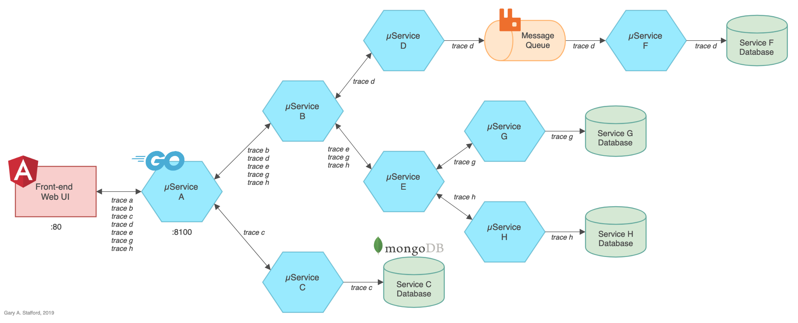

# Go-based Microservices Observability Demo with Istio 1.0

_Kubernetes Work In Progress_

The (7) Go-based, RESTful microservices, which make up the distributed system, are designed to generate service-to-service, service-to-db (MongoDB), and service-to-queue-to-service (RabbitMQ) IPC (inter-process communication). These distributed communications can be observed using Istio's observability tools, when the system is deployed to Kubernetes.

A 'trace' JSON object is returned by each service to the up-stream calling service (show below). The traces have no real function other than to confirm the service-to-service calls succeeded. They do not support or enhance Istio's observability capabilities.



## Build and Deploy Docker Stack

Build all images, create Docker overlay network, and deploy Swarm of (10) contains: (7) Go microservices, (1) RabbitMQ server with (1) queue, and (1) MongoDB server with (4) databases.

```bash
sh ./build_go_srv_images.sh
```

### Deployed Stack Services

```bash
> docker stack services golang-demo
```

```text
ID                  NAME                    MODE                REPLICAS            IMAGE                         PORTS
45jfnr9ggqlq        golang-demo_rabbitmq    replicated          1/1                 rabbitmq:management           *:5672->5672/tcp, *:15672->15672/tcp
5xpoiccfjt4d        golang-demo_service-a   replicated          1/1                 garystafford/go-srv-a:1.0.0   *:8100->8000/tcp
6zn4zmv4i67i        golang-demo_service-c   replicated          1/1                 garystafford/go-srv-c:1.0.0
9u4plk2kchyx        golang-demo_service-d   replicated          1/1                 garystafford/go-srv-d:1.0.0
m3l1u8vtytr8        golang-demo_service-b   replicated          1/1                 garystafford/go-srv-b:1.0.0
psmnn8ie1epw        golang-demo_service-g   replicated          1/1                 garystafford/go-srv-g:1.0.0
rh3erh9dieps        golang-demo_service-e   replicated          1/1                 garystafford/go-srv-e:1.0.0
tsfntd0s2hvt        golang-demo_service-h   replicated          1/1                 garystafford/go-srv-h:1.0.0
wci3a2b81j8m        golang-demo_service-f   replicated          1/1                 garystafford/go-srv-f:1.0.0
y90djpxktk64        golang-demo_mongodb     replicated          1/1                 mongo:latest                  *:27017->27017
```

## Accessing the Stack

To start, call Service A, the system
's edge service: <http://localhost:8100/ping>

To observe the queue traffic, use the RabbitMQ Management Console: <http://localhost:15672/>

To observe the databases, use MongoDB Compass: localhost:27017

## Output from Service A

```json
[
  {
    "id": "1575c539-7871-4b91-8788-a29fccc51dfd",
    "serviceName": "Service-D",
    "createdAt": "2019-02-04T01:01:14.2423788Z"
  },
  {
    "id": "00b8c6d9-ce6f-4570-b101-5a9b49c43d90",
    "serviceName": "Service-G",
    "createdAt": "2019-02-04T01:01:14.2807012Z"
  },
  {
    "id": "4c473aee-f2fe-4317-a283-f64e2e7c0db7",
    "serviceName": "Service-H",
    "createdAt": "2019-02-04T01:01:14.3016563Z"
  },
  {
    "id": "c59bbed1-2350-45ef-9588-361d97c1fa3b",
    "serviceName": "Service-E",
    "createdAt": "2019-02-04T01:01:14.3150472Z"
  },
  {
    "id": "92b6c13e-c43d-4488-8613-937baad90b74",
    "serviceName": "Service-B",
    "createdAt": "2019-02-04T01:01:14.3161737Z"
  },
  {
    "id": "29494eb4-baf9-4333-abc4-a4990b8d0f2b",
    "serviceName": "Service-C",
    "createdAt": "2019-02-04T01:01:14.3173983Z"
  },
  {
    "id": "7ca10884-6d4f-4cdd-adf9-9cc34d883d40",
    "serviceName": "Service-A",
    "createdAt": "2019-02-04T01:01:14.3287177Z"
  }
]
```

## Docker Stats

A quick look at the services and their typical loads, using Apache Bench (ab).

```bash
ab -kc 10 -n 1000 http://localhost:8100/ping
```

```bash
docker stats --all --format "table {{.Name}}\t{{.CPUPerc}}\t{{.MemUsage}}"
```

```text
NAME                                                CPU %               MEM USAGE / LIMIT
golang-demo_mongodb.1.k3kten2dg4sjba0s5l4o79w5b     47.05%              697.3MiB / 1.952GiB
golang-demo_rabbitmq.1.jittnz3ezzbh4cqnzqgcchlgd    5.08%               84.46MiB / 1.952GiB

golang-demo_service-a.1.lgtj4mj29ra4ify59v84nefqm   0.22%               6.859MiB / 1.952GiB
golang-demo_service-b.1.rux5d1je9s90aw28jf7x2ws6a   0.15%               6.969MiB / 1.952GiB
golang-demo_service-c.1.5olitvlahtnbz8daxx0cup4ty   30.27%              126.1MiB / 1.952GiB
golang-demo_service-d.1.vyge7w7q8213oyipeyu092zww   0.62%               5.855MiB / 1.952GiB
golang-demo_service-e.1.km2y4zfpelzq166os1hy3si0h   0.59%               7.117MiB / 1.952GiB
golang-demo_service-f.1.flhgix40ctk3j160v5sz82q1v   1.32%               1.695MiB / 1.952GiB
golang-demo_service-g.1.ii62ga8kqa3p44x94z97xknts   32.54%              122.7MiB / 1.952GiB
golang-demo_service-h.1.r75tk7cz4szwbluagrpaz04v6   29.78%              123.2MiB / 1.952GiB
```

## Other Useful Commands

```bash
docker exec -it \
  $(docker ps | grep golang-demo_mongodb.1 | awk '{print $NF}') sh
mongo
show dbs
use service-c
db.traces.find().pretty()

docker logs \
  $(docker ps | grep golang-demo_service-f.1 | awk '{print $NF}')

docker logs \
  $(docker ps | grep golang-demo_rabbitmq.1 | awk '{print $NF}')
```

## Build and Deploy GKE Cluster

Build and deploy to a (3) GKE Cluster. Requires Istio 1.0.5 is downloaded and available. Requires Helm to be available from the command-line, locally. Update constants in all scripts before running.

```bash
sh ./part3_create_gke_cluster.sh
sh ./part4_install_istio.sh
sh ./part5_deploy_resources.sh
```

## Tear Down GKE Cluster

```bash
sh ./part6_tear_down.sh
```
